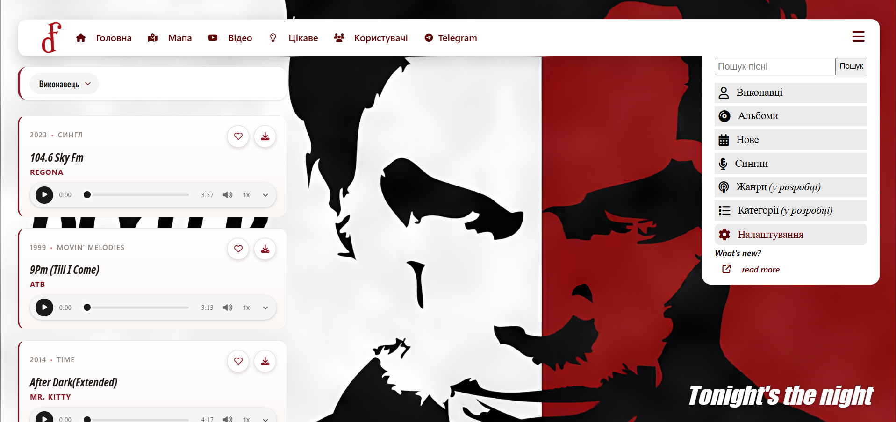
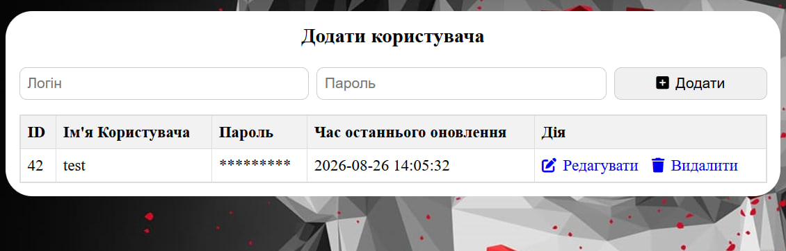
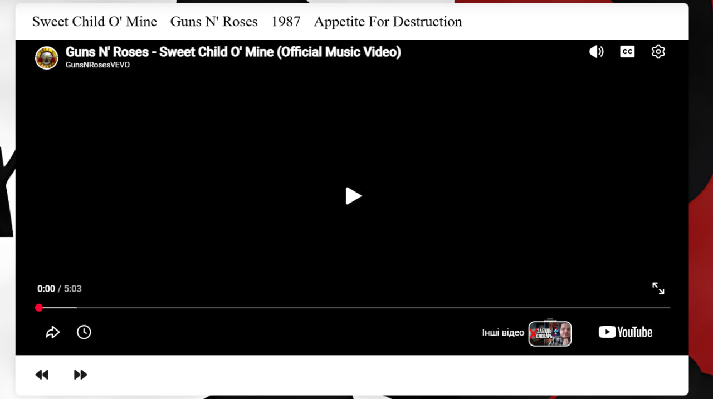
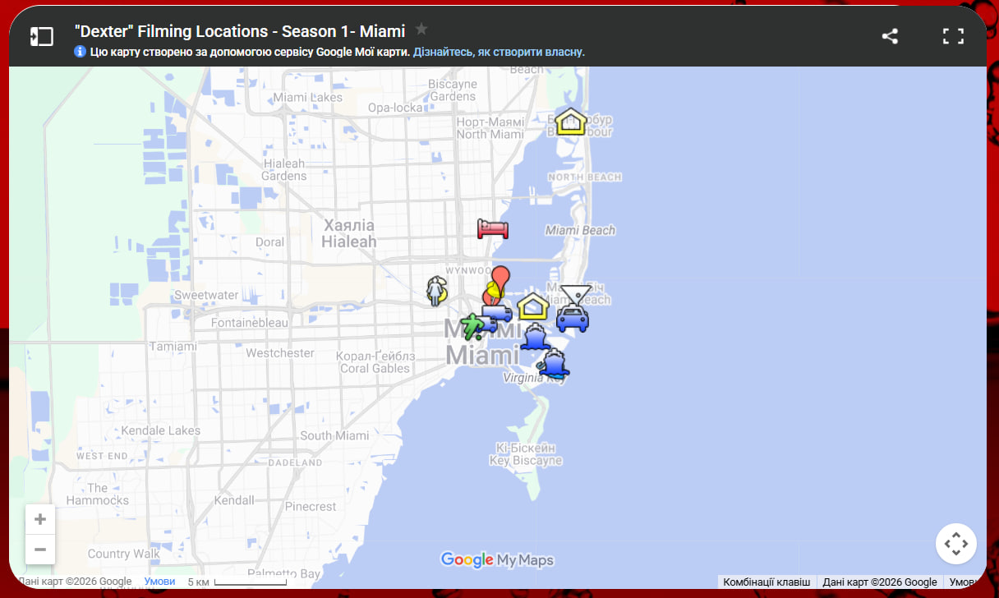

# Dexter Fimoser Music

**Version: alpha 1.1.0.2**

A PHP + MySQL web application for browsing, playing, and downloading a personal music collection. Built and tested on **XAMPP** (Apache + MySQL + PHP), with GD-based dynamic chart generation and a YouTube-powered video lookup for each track.

---

## Table of Contents

- [Overview](#overview)
- [Features](#features)
- [Usage Guide](#usage-guide)
- [Technologies](#technologies)
- [Project Structure](#project-structure)
- [Installation (XAMPP)](#installation-xampp)
- [Database Setup](#database-setup)
- [Configuration](#configuration)
- [Getting a YouTube Data API Key](#getting-a-youtube-data-api-key)
- [Enabling GD (with FreeType) in XAMPP](#enabling-gd-with-freetype-in-xampp)
- [Recommended songs](#recommended-songs)
- [Version changes](#version-changes)
- [Supported Language](#supported-language)
- [Feature Plans](#feature-plans)
- [Author](#author)

---

## Overview

Dexter Fimoser Music is a small multi-page PHP site that serves a local collection of MP3 files (parsed directly from filenames in the `mp3/` folder) together with a simple admin panel for a `accounts` table in MySQL, a dynamically generated pie chart of songs by decade, an embedded Google Map, and a live Telegram post feed with per-post existence checking.

<p align="center">
  
</p>

<p align="center">
  
</p>

<p align="center">
  
</p>

<p align="center">
  
</p>

The codebase is organized into feature folders (`db/`, `helpers/`, `includes/`, `telegramAPI/`, `changelog/`) with a shared header/menu/background system, rather than each page repeating its own boilerplate.

---

## Features

- **Music library** (`index.php`)
  - Songs are parsed on the fly from filenames in `mp3/`, in the format `Artist -- Year -- Album -- Title.mp3`.
  - Free-text search across title, artist, album, and year.
  - Filter by artist, by album (album list narrows to the selected artist), by "new" (current or previous year), and a dedicated "Singles" filter (album = "Сингл").
  - Sort the results by artist, year, album, or title.
  - Download or stream (via `<audio>`) any track directly from the list; like button placeholder for future favoriting.
- **Video lookup** (`videos.php`)
  - For the selected track, queries the YouTube Data API for a matching video and embeds it.
  - Falls back to a placeholder video if the API call fails (e.g. quota exceeded).
  - Previous/next navigation between tracks, with the last-played track remembered via a cookie.
- **User accounts admin panel** (`DB.php`, logic in `db/connect.php`, `db/db.js`)
  - Add, edit, and delete rows in the `accounts` table.
  - Passwords are hashed with `password_hash()` (bcrypt) and never stored or displayed in plain text - the table shows only asterisks matching the password length.
  - Editing requires re-entering the current password before a change is accepted.
  - Duplicate login names are rejected both on creation and on edit.
- **Dynamic chart** (`helpers/diagram.php`, used from `interesting.php`)
  - Renders a PNG pie chart (via the GD library) showing how many songs fall into each decade.
  - Visitors can contribute additional data points through a form, stored in the PHP session and merged into the chart.
- **Interactive map** (`map.php`) - an embedded Google My Maps view.
- **Telegram feed** (`telegram.php`, backend in `telegramAPI/`)
  - Infinite-scroll feed of channel posts using the official `telegram-widget.js` embed.
  - `telegramAPI/check_post.php` verifies each post ID server-side (in parallel, via `curl_multi`) before it's embedded, so deleted/missing posts are silently skipped instead of showing "Post not found" cards.
  - Results are cached in `cache/telegram_posts.json` (24h TTL) so repeat visits don't re-check the same IDs.
- **Site-wide background picker** (`includes/background.php`) - any image from `img/` can be set as the page background, remembered via a cookie (or reset to a random/default image). Shared across every page via `includes/header.php`.
- **Changelog page** (`changelog/changelog.php` + `changelog.css`) - bilingual (Ukrainian/English) version history.
- **Shared layout system** (`includes/header.php`, `includes/menu-index.php`, `includes/menu-simple.php`) - every page sets `$pageTitle` (and `$menuPartial` if it needs the full search/filter menu instead of the simple one) and includes `header.php`, instead of duplicating the `<head>`/nav/settings markup per page.
- **Responsive checkbox-driven menu** - no JavaScript framework, navigation and settings panels are toggled with hidden checkboxes and CSS.

---

## Usage Guide

### Browsing and playing music

1. Open the home page (`index.php`) - the full track list loads automatically.
2. Use the top search box to find a track by name, artist, album, or year.
3. Use the side menu to filter by **Виконавці** (artist), **Альбоми** (album, narrows once an artist is picked), **Нове** (new releases), or **Сингли** (singles).
4. Pick a sort order (artist / year / album / name) from the dropdown above the list.
5. Click the download icon to save a track, or use the inline audio player to listen directly.
6. Click a track title to open it on the **Відео** page, where a matching YouTube video is looked up automatically.

### Managing user accounts

1. Open the **Користувачі** page (`DB.php`).
2. To add a user: fill in **Логін** and **Пароль** (minimum 6 characters) and press **Додати**.
3. To edit a user: press **Редагувати** on their row, enter their current password plus a new login/password, and press **Зберегти**.
4. To remove a user: press **Видалити** and confirm.

### Customizing the background

Open **Налаштування** (gear icon) from the side menu on any page:
- Pick any image from the gallery to use it as the background.
- **Кожен раз випадковий фон** - a new random background on every page load.
- **Фон за замовчуванням** - reset to the default image.

### Exploring the chart

Open the **Цікаве** page (`interesting.php`) to see the decade-by-decade breakdown of the collection. Use the form below the chart to add extra data points (year + count), which are merged into the chart once you press **ОК**.

### Browsing the Telegram feed

Open the **Telegram** page (`telegram.php`). Posts load automatically and more load as you scroll down; deleted posts are skipped automatically.

---

## Technologies

- **PHP** - server-side logic (procedural style, `mysqli` with prepared statements)
- **MySQL / MariaDB** - via XAMPP, `mysqli` extension
- **GD library (with FreeType support)** - server-side PNG chart generation (`helpers/diagram.php`)
- **cURL (`curl_multi`)** - parallel Telegram post existence checks (`telegramAPI/check_post.php`)
- **HTML / CSS** - front-end markup and styling, checkbox-driven menus (no JS framework)
- **Font Awesome 6** (CDN) - icons
- **Google Fonts (Oswald)** (CDN) - typography
- **YouTube Data API v3** - video lookup for tracks
- **Google My Maps** (embedded iframe) - map page
- **Telegram Widget** (`telegram-widget.js`, embedded) - Telegram feed page

---

## Project Structure

```
├── index.php                 # Music library: search, filter, sort
├── videos.php                 # Track playback page + YouTube video lookup
├── DB.php                     # User accounts admin panel (list/add/edit/delete)
├── interesting.php            # Decade-breakdown chart page + contribution form
├── map.php                    # Embedded Google My Maps page
├── telegram.php                # Telegram feed page
├── style.css                   # Global site styles
│
├── db/
│   ├── connect.php             # MySQL connection + account CRUD logic
│   └── db.js                   # Inline edit-row toggle logic for DB.php
│
├── helpers/
│   ├── config.example.php      # Template for local secrets - copy to config.php
│   ├── config.php              # Real local secrets (gitignored)
│   └── diagram.php             # Dynamic PNG pie chart generator (GD)
│
├── includes/
│   ├── background.php          # Resolves/sets the page background (cookie + gallery)
│   ├── header.php               # Shared <head>, nav, settings panel, footer opener
│   ├── menu-index.php           # Full menu: search, artist/album filters, new/singles
│   └── menu-simple.php          # Minimal menu (settings + changelog link only)
│
├── telegramAPI/
│   ├── check_post.php           # Server-side existence check for Telegram posts
│   └── posts.js                 # Infinite-scroll loader for the Telegram feed
│
├── changelog/
│   ├── changelog.php            # Bilingual changelog page
│   └── changelog.css
│
├── fonts/
│   └── Noto Sans ExtCond.ttf    # Font used by helpers/diagram.php for chart labels
│
├── img/                          # Background images (also used as chart backgrounds)
├── logo/                         # Site logo
├── mp3/                          # Music library
│                                 # Filename format: Artist -- Year -- Album -- Title.mp3
│                                 # Add your own songs and ensure they follow this format for correct parsing
│ 
├── cache/                        # Generated: Telegram post-existence cache (gitignored)
└── dexterfimoser.sql              # Database dump (accounts table)
```

---

## Installation (XAMPP)

1. Install [XAMPP](https://www.apachefriends.org/) if not already installed.
2. Copy the project folder into your XAMPP `htdocs` directory, e.g.:
   ```
   D:\xampp\htdocs\project
   ```
3. Start **Apache** and **MySQL** from the XAMPP Control Panel.

---

## Database Setup

1. Open **phpMyAdmin** (`http://localhost/phpmyadmin`).
2. Create a database named `dexterfimoser`.
3. Import `db/dexterfimoser.sql` into it.
4. Set your local credentials - see [Configuration](#configuration) below.
5. Open the site at:
   ```
   http://localhost/project/
   ```

---

## Configuration

The repository does not include real database credentials or the YouTube API key - they must be set up locally before running the project.

1. Copy the template file and rename it:
   ```
   helpers/config.example.php  ->  helpers/config.php
   ```
2. Fill in your local values:
   ```php
   <?php
   return [
       'db' => [
           'host'     => 'localhost',
           'user'     => 'root',
           'password' => '',
           'dbname'   => 'dexterfimoser',
       ],
       'youtube_api_key' => 'YOUR_YOUTUBE_DATA_API_KEY',
   ];
   ```

**MP3 filename format:** files in `mp3/` must follow `Artist -- Year -- Album -- Title.mp3` exactly (double space + double dash + double space as separator) or they will be skipped/flagged as invalid.

---

## Getting a YouTube Data API Key

`videos.php` needs a YouTube Data API v3 key to look up a video for each track. Without one, it falls back to a fixed placeholder video.

1. Go to the [Google Cloud Console](https://console.cloud.google.com/) and sign in.
2. Create a new project (top bar -> **Select a project** -> **New Project**), or pick an existing one.
3. Open **APIs & Services -> Library**, search for **YouTube Data API v3**, and click **Enable**.
4. Go to **APIs & Services -> Credentials -> + Create Credentials -> API key**.
5. Copy the generated key into `helpers/config.php` as `youtube_api_key`.
6. (Recommended) Click **Restrict key** on the credential you just created:
   - Under **API restrictions**, choose **Restrict key** and select only **YouTube Data API v3**.
   - This limits what the key can be used for if it ever leaks.

**Quota note:** the free tier has a limited daily quota (a `search.list` call, which this project uses, is relatively expensive per request). If `videos.php` starts showing the "перевищено квоту" error, you've hit the daily limit - it resets at midnight Pacific Time.

---

## Enabling GD (with FreeType) in XAMPP

`helpers/diagram.php` uses the GD library (`imagettftext`, `imagettfbbox`) to render chart labels with the font in `fonts/Noto Sans ExtCond.ttf`. On some XAMPP installs, the `gd` extension is not enabled by default.

1. Open the **XAMPP Control Panel** -> click **Config** next to **Apache** -> choose **PHP (php.ini)**. This opens the exact `php.ini` Apache uses (avoids editing the wrong copy if multiple PHP installs exist on the machine).
2. Find the line:
   ```ini
   ;extension=gd
   ```
   Remove the leading `;` so it reads:
   ```ini
   extension=gd
   ```
3. Save the file.
4. In the XAMPP Control Panel, **Stop** and then **Start** Apache (the extension only loads on process start).
5. Verify it worked: open `http://localhost/dashboard/phpinfo.php` in your browser and search (Ctrl+F) for the **gd** section - it should show `GD Support => enabled` and `FreeType Support => enabled`.

If the `gd` section still doesn't appear after this, check that `extension_dir` in the same `php.ini` points to the actual `ext` folder shipped with your XAMPP install, and that `php_gd.dll` exists there.

**Also required:** the `curl` extension (used by `telegramAPI/check_post.php`). It's enabled by default in standard XAMPP builds, but can be verified the same way - search for **curl** on the `phpinfo.php` page.

---

## Recommended Songs

The site's `mp3/` folder is empty by default - add your own audio files
following the naming format above. Here's the track list of recommended songs that evoke the vibe of "Dexter":

| Artist | Title | Year | Album |
|---|---|---|---|
| AC-DC | Back In Black | 1980 | Back In Black |
| AC-DC | Givin' The Dog A Bone | 1980 | Back In Black |
| AC-DC | Highway To Hell | 1979 | Highway to Hell |
| AC-DC | T.N.T. | 1976 | High Voltage |
| AC-DC | Thunderstruck | 1990 | The Razors Edge |
| AC-DC | You Shook Me All Night Long | 1980 | Back In Black |
| adore | did i tell u that i miss u - slowed | 2024 | Сингл |
| Alex Ferrari | Bara Bará Bere Berê (Radio Edit) | 2012 | Bara Berê |
| algebraburr shrine | Alice Deejay - 2nd Part Extended | 2023 | Сингл |
| Alice DJ | Better Off Alone | 2010 | Who Needs Guitars |
| ATB | 9Pm (Till I Come) | 1999 | Movin' Melodies |
| bambee | bumble-bee | 2021 | Сингл |
| Basshunter | DotA - Radio Edit | 2008 | Now you're Gone |
| Bee Gees | Stayin Alive | 1977 | Сингл |
| Charli xcx, Kim Petras, Jay Park | Unlock it (Lock It) - feat. Kim Petras and Jay Park | 2017 | Pop 2 |
| Chevelle | Comfortable Liar | 2002 | Wonder What's Next |
| Chuck Berry | Johnny B. Goode | 1959 | Berry Is On Top |
| Chuck Berry | You Never Can Tell | 1964 | St. Louis To Liverpool |
| Clover!, DulaWry | Pretty Scene Girl! | 2023 | Сингл |
| Daniel Licht Michael C. Hall | Tonight's the Night | 2006 | Сингл |
| DARKSIDE | Paper Trails | 2013 | Psychic |
| David Guetta, Kid Cudi | Memories (feat. Kid Cudi) | 2011 | One More Love |
| Dean Martin | Sway (Quien Sera) | 1954 | Сингл |
| Deftones | Sextape | 2008 | Diamond Eyes |
| Depeche Mode | Enjoy the Silence | 1990 | Violator |
| Depeche Mode | Personal Jesus | 1990 | Violator |
| devi1ma7cry | Hello , Dexter Morgan | 2024 | Сингл |
| Discotronic | Tricky Disco (Single Edit) | 2020 | Andrew Spencer Presents My Favorite Mental Madness Hits |
| Discotronic | Tricky Disco - Single Edit | 2006 | Сингл |
| Dominic Fike | Babydoll | 2018 | Don't Forget About Me, Demos |
| Echo & the Bunnymen | The Killing Moon | 1985 | Sogs to Learn & Sing |
| Eurythmics, Annie Lennox, Dave Stewart | Sweet Dreams (Are Made of This) | 1983 | Sweet Dreams |
| Ferdinand fka Left Boy | Sweet Dreams (Sky like Dreams) | 2023 | Сингл |
| Fly Project | Toca Toca | 2013 | Toca Toca (Remixes) |
| Gigi D'Agostino | L'Amour Toujours | 1999 | Сингл |
| Grover Washington, Jr., Bill Withers | Just The Two Of Us | 1985 |  Anthology |
| Guns N' Roses | Sweet Child O' Mine | 1987 | Appetite For Destruction |
| Ilysam | sweet rally | 2024 | Сингл |
| Incubus | Drive | 1999 | Make Yourself |
| Las Ketchup | The Ketchup Song (Asareje) | 2002 | Hijas del Tomate |
| Loona | Bailando | 2020 | Stars |
| Loona | Vamos a la Playa | 2020 | Stars |
| Lou Bega | Mambo No. 5 (A Little Bit of...) | 1999 | A Little Bit of Mambo |
| Lucky Twice | Lucky (Nightcore Mix) | 2022 | Young & Clever |
| Luke Willies | Solitude Velocity - slowed reverb | 2023 | Сингл |
| Lykke Li, The Magician | I Follow Rivers - The Magician Remix | 2011 | Сингл |
| Lynyrd Skynyrd | Sweet Home Alabama | 1974 | Second Helping |
| Mambo Mambo Mambo | Perfidia | 1997 | Mambo Mambo Mambo |
| Mareux | The Perfect Girl | 2021 | Сингл |
| Marilyn Manson | Sweet Dreams (Are Made Of This) | 1995 | Smells Like Children |
| Michael Gray | The Weekend - Radio Edit | 2007 | Analog Is On |
| Modjo | Lady - Hear Me Tonight | 2001 | Modjo(Remastered) |
| Mr. Kitty | After Dark(Extended) | 2014 | Time |
| Mr. President | Coco Jamboo | 1996 | We See The Same Sun |
| Neil Diamond | Sweet Caroline | 1969 | Sweet Caroline |
| Nirvana | Blew | 1989 | Bleach |
| Nirvana | Come As You Are  | 1991 | Nevermind |
| Nirvana | Drain You | 1991 | Nevermind |
| Nirvana | Heart Shaped Box  | 1993 | In Utero |
| Nirvana | Lithium  | 1991 | Nevermind |
| Nirvana | Lounge Act | 1991 | Nevermind |
| Nirvana | Rape Me | 1993 | In Utero |
| Nirvana | Smells Like Teen Spirit  | 1991 | Nevermind |
| Nirvana | Something In The Way | 1991 | Nevermind |
| Nirvana | Stay Away | 1991 | Nevermind |
| No Doubt | Hella Good | 2001 | Rock Steady |
| Odetari | HYPNOTIC DATA | 2024 | Сингл |
| Odetari | KEEP UP (Slowed&Reverb) | 2024 | Сингл |
| Orange Sector | Farben | 2016 | Farben |
| Papa Roach | Getting Away With Murder | 2004 | Getting Away With Murder |
| Paradisio | Bailando | 1997 | Tarpeia |
| Pastel Ghost | Iris | 2015 | Ethereality |
| Phil Collins | In the Air Tonight | 1981 | Face Value |
| Pitbull, AFROJACK, Ne-Yo, Nayer | Give Me Everything | 2011 | Planet Pit |
| Rammstein | Rein raus | 2001 | Mutter |
| Red Hot Chili Peppers | By the Way | 2002 | By thr Way |
| Red Hot Chili Peppers | Dark Necessities | 2016 | The Getaway |
| Regona | 104.6 Sky Fm | 2023 | Сингл |
| Rolfe Kent | Dexter - Main Theme | 2006 | Сингл |
| Roy Bee | Kiss Me Again - Radio Edit | 2009 | Сингл |
| Royal Blood | Figure It Out | 2014 | Royal Blood |
| saraunh0ly | wutiwant | 2022 | Сингл |
| She Wants Revenge | Tear You Apart | 2005 | She Wants Revenge |
| Snow Strippers | Under Your Spell | 2023 | April Mixtape 3 |
| Soap&Skin | Me and the Devil | 2013 | Sugarbread |
| Stardust | Music Sounds Better With You - feat. Benjamin Diamond, Alan Braxe, Thomas Bangalter | 1998 | Сингл |
| Tame Impala | Dracula | 2025 | Deadbeat |
| The Doors | Break On Through (to the other side) | 1967 | The Doors |
| The Doors | People Are Strange | 1967 | Strange Days |
| The Doors | Riders on the Storm | 1971 | L. A. Women |
| The Doors | Roadhouse Blues | 1970 | Morrison Hotel |
| The Heavy | How You Like Me Now | 2009 | The House That Dirt Built |
| The Heavy | Short Change Hero | 2009 | The House That Dirt Built |
| The Heavy | The Big Bad Wolf | 2012 | The Glorious Dead |
| The Rolling Stones | Paint It, Black | 1966 | Aftermath |
| Tila Tsoli, BJ Lips | Bimbo Doll | 2021 | Сингл |
| Ultra Sunn | Keep Your Eyes Peeled | 2024 | Keep Your Eyes Peeled |
| Vendredi sur mer | Écoute Chérie | 2019 | Premiers émois |
| Videoclub, Adèle Castillon, Mattyeux | Roi | 2021 | Euphories |
| vyrval | ✻H+3+ЯД✻7luCJIo0T6... | 2024 | Сингл |
| Wac Toja | KOLEJNA NOC (Siup Siup Hops Ops) | 2026 | Сингл |

---

## Version Changes

### `alpha 1.1.0.2`
**27.08.2026**

- Reorganized the entire project into feature folders:
  - database logic
  - configuration and helpers
  - shared page layout
  - Telegram backend
  - changelog
  - fonts
- Extracted the shared page header, navigation, and settings panel into a reusable template used by every page.
- Extracted the background-picker logic into a shared, reusable file.
- Replaced the single embedded Telegram post with a full infinite-scroll feed using real posts from the site's own channel.
- Added server-side verification of Telegram posts before embedding them, so deleted or missing posts are skipped instead of displaying **"Post not found"** cards.
- Added caching for Telegram post checks to prevent unnecessary repeated verification.
- Fixed the sorting panel layout on the home page:
  - the **Sort by** bar remains fixed at the top;
  - the song list scrolls independently underneath it;
  - the scrollbar is hidden;
  - a stable visual gap is maintained between the controls and the song list.
- Extracted the accounts admin panel's inline JavaScript into a dedicated `db.js` file.
- Removed the **Sort by** button - songs are now sorted automatically as soon as a sorting criterion is selected.
- Redesigned the sorting panel
- Completely redesigned the music player, including both its design and functionality. When switching from one song to another, the previous song is now paused instead of being stopped, so it can later be resumed from the same position.,
- Added list of recommended songs.

---

### `alpha 1.1.0.1`
**25.08.2026**

- Removed a leftover, unreachable block of duplicate edit-row code from the user accounts admin panel.
- Fixed a chart legend sizing bug on the **Interesting** page where label width was measured incorrectly.
- Added a configuration template for setting up the project on a new machine.

---

### `alpha 1.0.0.4`
**27.11.2024**

- Added a page listing all registered user accounts.
- Added user creation with login and password validation.
- Passwords are hashed immediately and are never stored or displayed in plain text.
- Added unique IDs and last-updated timestamps for user records.
- Passwords displayed in the admin panel are represented only by asterisks.
- Added user editing and deletion.
- Added current-password confirmation before changing a user's login or password.
- Added duplicate-login validation when creating and editing accounts.
- Added a new Telegram page using the official Telegram widget.
- Added an initial demo post to showcase the Telegram integration.

---

### `alpha 1.0.0.3`
**30.10.2024**

- Added an interactive **Map** page with iconic locations from the show across Miami and the surrounding area using Google My Maps.
- Added a **Music Video** page with automatic YouTube video lookup via the YouTube Data API.
- Track titles on the home page now open the corresponding video page.
- Added an **Interesting** page with a chart grouping songs by decade.
- Added the ability for visitors to enter their own year/count data and generate a personalized version of the chart.
- Added a quote from Zhang Xin about the symbolic value of architecture, reinforcing the idea behind the chart.

---

### `alpha 1.0.0.2`
**26.10.2024**

- Removed contact information from the menu.
- Added icons to menu items.
- Added a link to the changelog.
- Added dynamic background switching.
- Added page navigation.
- Fixed a bug where success/error messages could break the menu styling.
- Added a logo next to the navigation.
- Adjusted music blocks to prevent conflicts with the header.
- Added scrolling to the song feed.
- Added the **Map** page.
- Added the **Interesting** page.
- Added the **Settings** panel.

---

### `alpha 1.0.0.1`
**16.10.2024**

- Implemented the basic functionality of the main page.
- Added a music library with the ability to listen to and download songs.
- Added song sorting.
- Added the main menu with filtering by:
  - artist
  - album
  - new songs
  - singles
- Artist and album filters can be combined.
- Added contact information.
- Added genre and category filters as placeholders for future development.
- Added song search by:
  - title
  - album
  - year
  - artist
- Added initial search functionality, with combined search queries not yet supported.

---

## Supported Language

- Ukrainian (primary interface)
- English (changelog page only, via `?lang=en`)

---

## Feature Plans
 
- Implement user login/authentication for site visitors
- Save favorited songs per user
- Add favorited filter
- Translate the interface to English
- Add song genres filter
- Add song categories filter
- Overall UI/UX improvement

---

## Author

Fozend